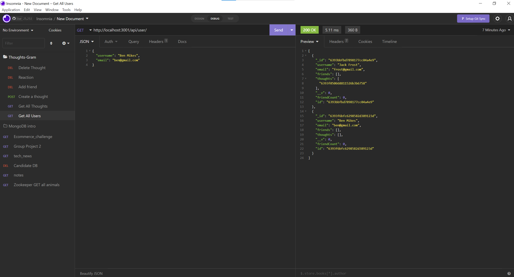

# Title
thoughts_gram

# Table of Contents
[Description](#description)

[Installation](#instalation)

[Usage](#usage)

[Contributors](#contributors)

[Walkthrough Video](#walkthroughvideo)

[Questions](#questions)

## Description
This is the backend api for thoughts_gram, a social website where users and share and react to each other's thoughts.

## Installation
Clone the repo, and type npm i on terminal to install the dependencies, then type npm start to connect to the mongoDB server and test out endpoints

## Usage
For the fronend website for the thoughts_gram social website

## Contribution
Mohammad Komol Hasan

## WalkthroughVideo
https://drive.google.com/file/d/1A2LYAyUTFV-hWb50ZoJyYCzQEY_9AhDb/view

## Questions
GitHub: MKHLink

Email: likhonhasankomol@gmail.com
    